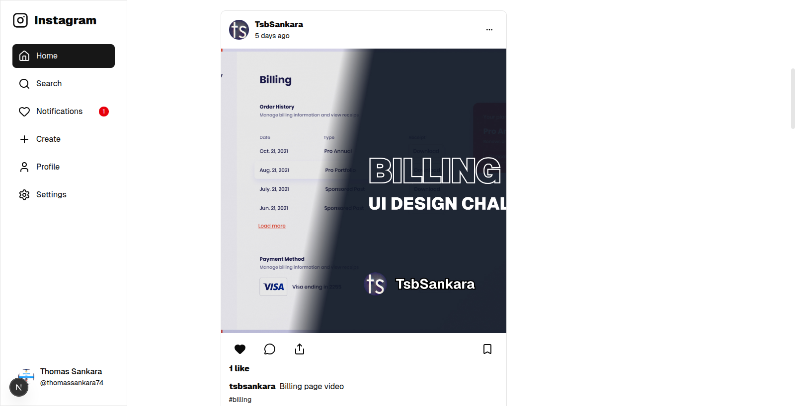

# Preview

## Requirements

1. NodeJS installed on your machine
2. `npm` or any other package manager you are comfortable with, such as `yarn`, `pnpm` or `bun`. This will help us to create our NextJS application as well as install dependencies we will need.
3.

## Tech Stack

1. Frontend

## How to run

## Follow me
